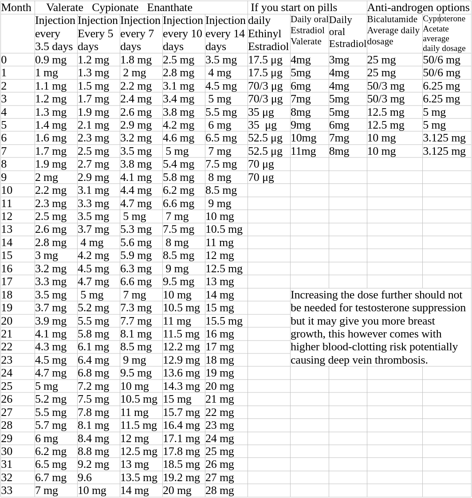

## Estradiol

Estradiol injections are the preferred method of hormone therapy for male-to-female transition, as they provide an immediate and sustained dose of the hormone. Estradiol pills and patches are less effective, but may be more convenient for some individuals looking to DIY.

## Estradiol Injections
Estradiol injections are a commonly used hormone therapy for male-to-female transition. Injections are the most effective way of administering estradiol, as they provide an immediate and sustained dose of the hormone. According to the World Professional Association for Transgender Health (WPATH) Standards of Care, ***injections of estradiol are the preferred method of estrogen therapy for those transitioning from male to female*** (1).

## Estradiol Pills
Estradiol pills are another form of hormone therapy for male-to-female transition. Pills are less effective than injections, as they provide a less consistent dose of the hormone, and may require higher doses to achieve the same effect. Additionally, estradiol pills can be difficult to absorb and may cause gastrointestinal side effects (2). See [About Pills](E_PILLS)

## Estradiol Patches
Estradiol patches are a form of hormone therapy for male-to-female transition. Patches are applied to the skin and provide a sustained release of the hormone. While patches are less effective than injections, they are more effective than pills, and may provide a more consistent dose of estradiol (3). See [About Patches](E_PATCHES)

## Reference Dosages

## Safety
The blood clotting risk relative to the effective dosage is higher for oral administration but it's still safer
than taking birth control as cis female. 
[link](https://www.prnewswire.com/news-releases/studies-find-that-transgender-hormone-therapy-is-less-risky-than-birth-control-pills-300770439.html)

# TODO - verify
References:
1. Coleman, E., Bockting, W., Botzer, M., Cohen-Kettenis, P., DeCuypere, G., Feldman, J., & Meyer, W. (2011). Standards of care for the health of transsexual, transgender, and gender-nonconforming people, version 7. International Journal of Transgenderism, 13(4), 165-232.
2. Gooren, L. J., & Giltay, E. J. (2006). Long-term treatment of transsexuals with cross-sex hormones: extensive personal experience. Journal of Clinical Endocrinology & Metabolism, 91(2), 499-505.
3. Wierckx, K., Mueller, S., Weyers, S., Van Caenegem, E., & T'Sjoen, G. (2012). Estradiol levels achieved with different transdermal estradiol formulations in transsexual women. The Journal of Clinical Endocrinology & Metabolism, 97(7), 2434-2440.