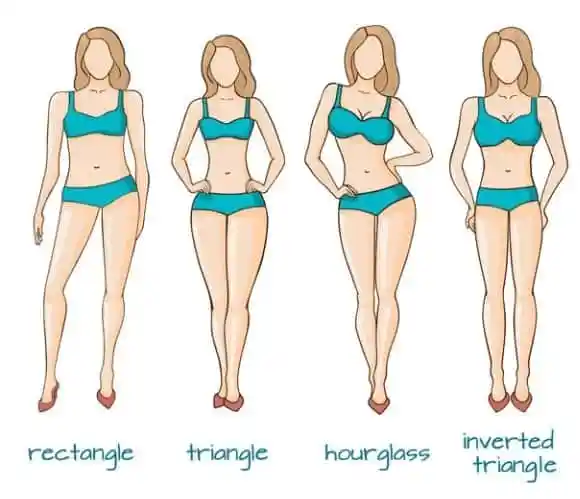

# Wardrobe

Transitioning from the drab world of guy cloths to the way more exciting and beautiful world of feminine cloths can be daunting! Here's some tips below, but also check out some amazing resources from [Pinkfemme](https://pinkfemme.com/category/style-and-fashion/) - they've compiled an incredible list of different styles and suitability for those pursuing a feminine transition. Some pages and content are linked here, but more is available at their site. Like it or not, some things just might not suit our body type - you will need to try it out and see what works for you. Think of this as part of the fun of femininity!

## Early Transition

As you start HRT you will have fat redistribution, and as you approach your [body goals](FITNESS) things might not end up the same fit for you even a few months down the line.

{: .highlight }
> Don't buy too many clothes during this period. As your waist and hip size changes from a male ratio to female, clothes just won't fit you the same

On a secondary note, women's clothing has an incredible variety of colors, textures, and patterns that aren't usually available in men's clothing. You can be overwhelemed at the choices and may make decisions on clothes that might not have lasting value. These clothes can be satisfying to buy in the moment or to wear once, but might not become a part of your everyday attire.

{: .highlight }
> Your style might change as you discover feminine style. Keep options open and question long term style goals to develop your own [Aesthetic](AESTHETICS)

But what if you have a large collection of men's clothes? Well good news! Most men's clothing can be repurposed or upcycled into distinct feminine looks. T-shirts in particular can be simply cut to give feminine flair.

{: .highlight }
> Style old boy cloths in a feminine fashion. T-shirts and jeans can be cut to make cute outfits with a semi-boyish fit!

<iframe width="560" height="315" src="https://www.youtube.com/embed/YLkYStVgBSA" title="YouTube video player" frameborder="0" allow="accelerometer; autoplay; clipboard-write; encrypted-media; gyroscope; picture-in-picture; web-share" allowfullscreen></iframe>

 

You can also style guy jeans by adding feminine flair such as strappy heels or sandals and a tucked in white or pastel t-shirt. [Boyfriend Jeans](https://pinkfemme.com/tips-and-tricks-to-make-boyfriend-jeans-look-feminine/)

## Underwear & "Tucking"

TODO - find info

### Bras

TODO - find info

> ***Sports Bras***
>
> Sports bras can be a great tool for a transitioning woman. They offer compression (which might be required if boymoding) while also encouraging support for growing breasts. Sports bras shouldn't be the only bra you own, but they might be a good first! Some can even double as a cute crop to wear for the house or gym.

## Corsets

Corsetry can help your breast and butt look bigger by moving the soft tissue on your waist - giving your waist a thinner look. Check out the guide on [Corsetry](https://pinkfemme.com/starting-out-waist-training-beginners-guide-to-corsets/) from PinkFemme.

## Fitting to Your Body Type

[PinkFemme](https://pinkfemme.com/how-to-dress-to-your-femme-body-shape/) truly has a great resource on this and summarizes the role of body shape succinctly:

> How to dress to your femme body shape? Take your measurements and learn your basic body shape. Your size or weight is irrelevant.
>
>**Inverted Triangle**: Fitted Jackets with a nipped-in waist and flared bottom.
>
>**Rectangle**: Skirts with volume-increasing details like ruffles, bows, pleats, pockets or embellishments.
>
>**Triangle**: Fit-and-flare dresses
>
>**Hourglass**: Anything that is fitted around the waist and bosoms.

 

### Broad Shoulders

Most transwomen will have a shape much like the inverted triangle - the relevant advice?

> The inverted triangle is when your shoulders or bust line is larger than your hips. In terms of numbers, you are looking at a difference of 5% or more. This is calculated by dividing your shoulder or bust measurement by your hip measurement.
>
> You are an inverted triangle if your shoulder or bust measurement is more than 5% bigger than your hip measurement.
>
> For example, if your shoulders (or bust) measure 36 inches and your hips measure 34.25 inches or smaller that will give a ratio of 1.05 or bigger.
>
>You are in good celebrity company as an inverted triangle with Cate Blanchet and Halle Berry. If you look at how they are styled you will see a theme of looks good on both of them.
>
> The signature piece that will always look great: Fitted jackets with a nipped-in waist and flared bottom.
>
> Why: The defined waist and flare over your hips will create the illusion of lower-body curves and help balance out your shoulders.

There are also other ways to make broad shoulders feminine: [PinkFemme on Broad Shoulders](https://pinkfemme.com/making-broad-shoulders-look-more-feminine/)